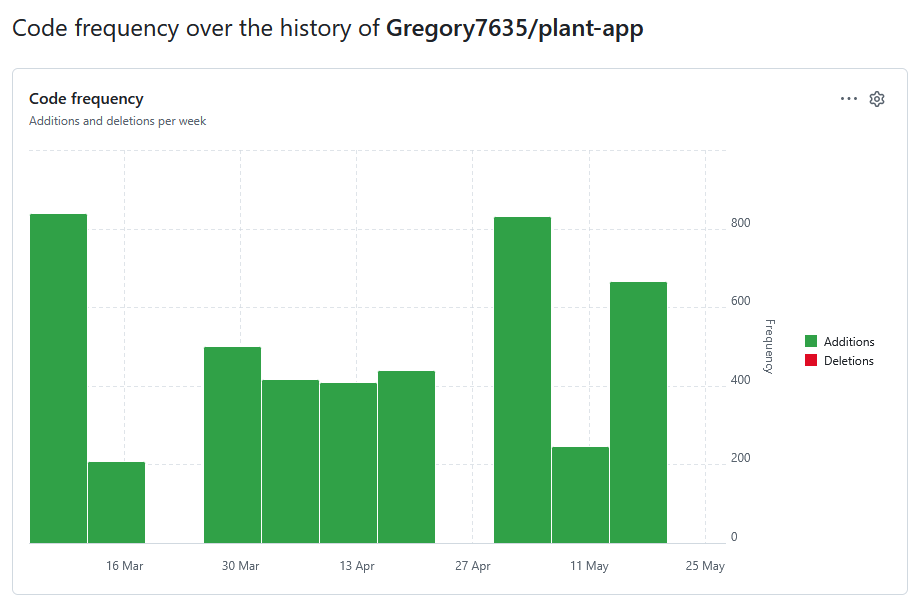
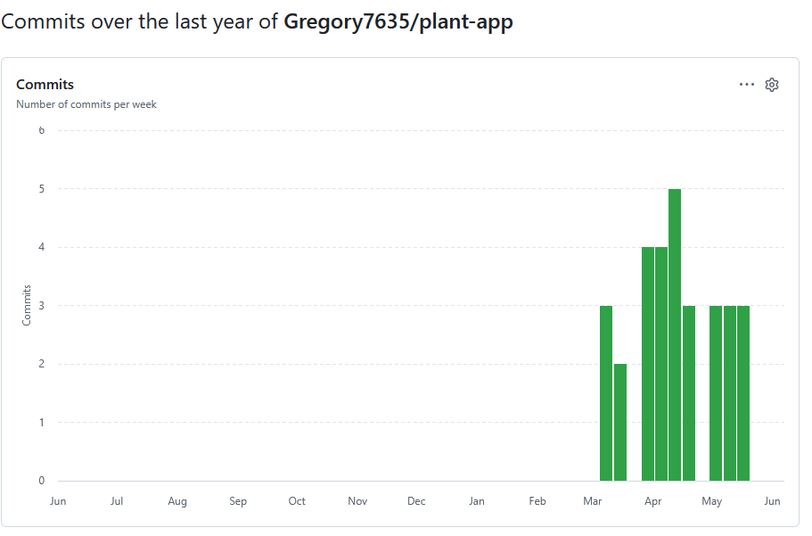

# Plant Identification Web Application

## О проекте

Веб-приложение для идентификации растений по фотографии с использованием Plant.id API.

Проект разработан на Java + Spring Boot в соответствии с архитектурой PCMEF.

Пользователь может:

* загружать фотографии растений;
* получать идентификацию растения;
* просматривать описание из Wikipedia;
* хранить историю определений;
* авторизовываться и регистрироваться;
* использовать REST API;
* запускать приложение через Docker.

---

# Технологический стек

| Компонент        | Технология                  |
| ---------------- | --------------------------- |
| Язык             | Java 17                     |
| Backend          | Spring Boot                 |
| Security         | Spring Security             |
| ORM              | Spring Data JPA / Hibernate |
| База данных      | PostgreSQL                  |
| Frontend         | Thymeleaf + Bootstrap       |
| REST API         | Spring Web MVC              |
| Документация API | Swagger / OpenAPI           |
| Тестирование     | JUnit 5 + JaCoCo            |
| Контейнеризация  | Docker + Docker Compose     |
| Сборка           | Maven                       |

---

# Архитектура проекта (PCMEF)

```text
Presentation → Control → Mediator → Entity → Foundation
```

## Слои

### Presentation

HTML-страницы, Thymeleaf шаблоны, Bootstrap UI.

### Control

Spring MVC controllers и REST controllers.

### Mediator

Бизнес-логика приложения.

### Entity

JPA сущности.

### Foundation

Repository слой.

---

# Основной функционал

## Пользователь

* регистрация;
* авторизация;
* logout;
* просмотр истории определений.

## Идентификация растений

* загрузка фотографии;
* отправка изображения в Plant.id API;
* получение результата;
* сохранение истории;
* получение описания из Wikipedia API.

## REST API

Реализованы REST endpoints:

| Метод  | Endpoint                       |
| ------ | ------------------------------ |
| GET    | /api/plants                    |
| GET    | /api/plants/{id}               |
| POST   | /api/plants                    |
| PUT    | /api/plants/{id}               |
| DELETE | /api/plants/{id}               |
| GET    | /api/identifications           |
| GET    | /api/identifications/user/{id} |
| GET    | /api/users/me                  |

---

# Безопасность

Используется Spring Security.

Реализовано:

* BCrypt password hashing;
* role-based authorization;
* защита маршрутов;
* защита от SQL Injection через JPA;
* валидация данных.

Роли:

* ROLE_USER
* ROLE_ADMIN

---

# AJAX

Для отправки формы определения используется Fetch API.

Особенности:

* без перезагрузки страницы;
* динамическое обновление результата;
* loader/spinner во время запроса.

---

# Swagger / OpenAPI

Swagger UI доступен по адресу:

```text
http://localhost:8080/swagger-ui/index.html
```

---

# Структура проекта

```text
src/main/java/com/example/plantapp
│
├── control
├── mediator
├── entity
├── foundation
└── config

src/main/resources
│
├── templates
└── application.properties
```

---

# Запуск проекта локально

## Требования

* Java 17+
* Maven
* PostgreSQL

---

## Настройка базы данных

Создать БД:

```sql
CREATE DATABASE plantdb;
```

Дамп готовой базы - plantdb.sql

---

## application.properties

```properties
spring.datasource.url=jdbc:postgresql://localhost:5432/plantdb
spring.datasource.username=postgres
spring.datasource.password=postgres

spring.jpa.hibernate.ddl-auto=update
```

---

## Сборка

```bash
mvn clean package
```

---

## Запуск

```bash
mvn spring-boot:run
```

или

```bash
java -jar target/plantapp-0.0.1-SNAPSHOT.jar
```

---

# Docker запуск

## Запуск приложения

```bash
docker compose up --build
```

---

## После запуска

Приложение:

```text
http://localhost:8080
```

Swagger:

```text
http://localhost:8080/swagger-ui/index.html
```

---

# Тестирование

Используются:

* JUnit 5;
* Spring Boot Test;
* DataJpaTest;
* JaCoCo.

---

## Запуск тестов

```bash
mvn test
```

---

## Отчёт покрытия

```text
target/site/jacoco/index.html
```

---

## Готовая сборка WAR

```text
plantapp.war
```

Для сборки в war необходимо добавить в pom.xml в основной блок <project>
```xml
<packaging>war</packaging>
```

После запустить сборку
```bash
mvn clean package
```

---

# Docker Compose

Сервисы:

* app — Spring Boot application;
* postgres — PostgreSQL database.

---

# Документация по этапам

| Этап | Описание |
|---|---|
| [01 — Бизнес-модель](docs/01-business-model/README.md) | IDEF0, BUC-диаграмма, глоссарий |
| [02 — Требования](docs/02-requirements/README.md) | Use Case, Domain Model |
| [03 — Архитектура](docs/03-architecture/README.md) | PCMEF-диаграмма, интерфейсы |
| [04 — База данных](docs/04-database/README.md) | ER-диаграмма, DDL |
| [05 — Проектирование](docs/05-design/README.md) | Sequence-диаграммы |
| [06 — Реализация](docs/06-implementation/README.md) | Структура кода, тесты |
| [07 — UI](docs/07-ui/README.md) | Скриншоты интерфейса |
| [08 — Финал](docs/08-final/README.md) | Руководства, спецификация |

---

# Статистика разработки




| Метрика | Значение |
|---|---|
| Общее количество коммитов | 32 |
| Начало разработки | 13 марта 2026 |
| Завершение | 20 мая 2026 |
| Период разработки | ~10 недель |
