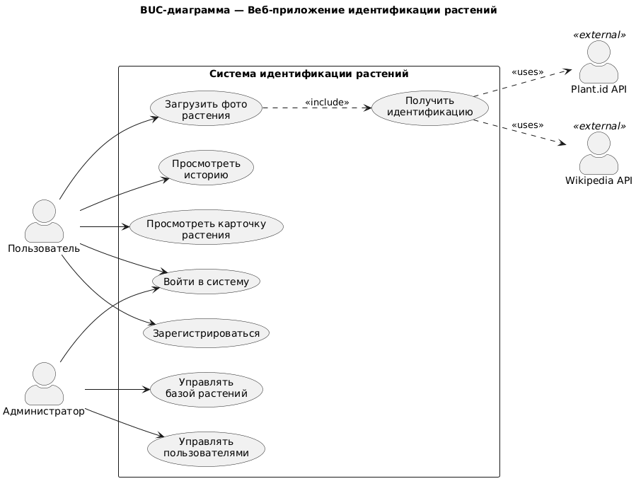
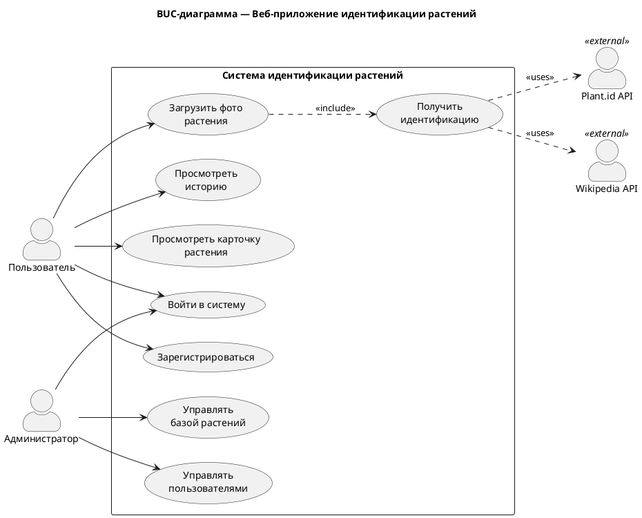

# BUC-диаграмма (Business Use Case)

## Описание

BUC-диаграмма отображает бизнес-процессы системы и их участников на уровне предметной области.

## PlantUML-код

```plantuml
@startuml buc-diagram
left to right direction
skinparam actorStyle awesome

title BUC-диаграмма — Веб-приложение идентификации растений

actor "Пользователь" as User
actor "Администратор" as Admin
actor "Plant.id API" as PlantAPI <<external>>
actor "Wikipedia API" as WikiAPI <<external>>

rectangle "Система идентификации растений" {
  usecase "Зарегистрироваться" as UC1
  usecase "Войти в систему" as UC2
  usecase "Загрузить фото\nрастения" as UC3
  usecase "Получить\nидентификацию" as UC4
  usecase "Просмотреть\nисторию" as UC5
  usecase "Просмотреть карточку\nрастения" as UC6
  usecase "Управлять\nпользователями" as UC7
  usecase "Управлять\nбазой растений" as UC8
}

User --> UC1
User --> UC2
User --> UC3
User --> UC5
User --> UC6

UC3 ..> UC4 : <<include>>
UC4 ..> PlantAPI : <<uses>>
UC4 ..> WikiAPI : <<uses>>

Admin --> UC2
Admin --> UC7
Admin --> UC8
@enduml
```