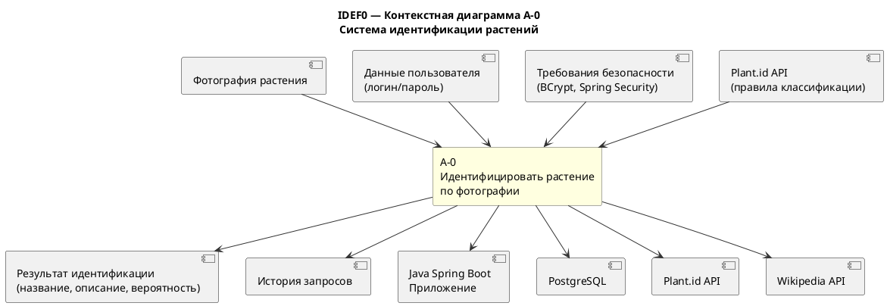

# Контекстная диаграмма IDEF0

## Описание

Диаграмма A-0 описывает систему как единый процесс с входами, выходами, управляющими воздействиями и механизмами.

## PlantUML-код

> Скопируй код выше на [plantuml.com](https://www.plantuml.com/plantuml/uml/), скачай PNG и сохрани как `docs/01-business-model/images/idef0-context.png`
