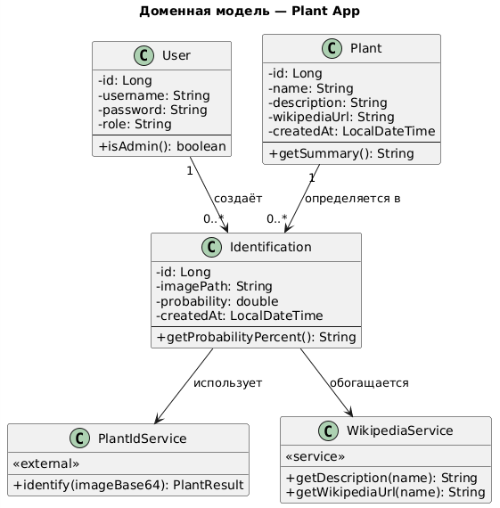
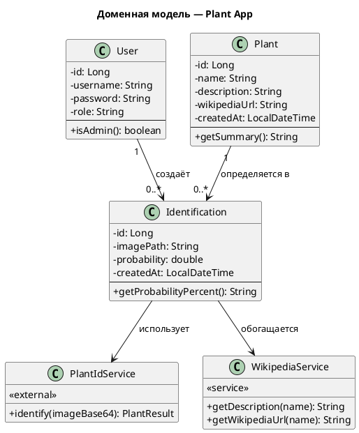

# Domain Model (Доменная модель)

## Описание

Доменная модель отображает основные сущности предметной области и их взаимосвязи.

## PlantUML-код

```plantuml
@startuml domain-model
skinparam classAttributeIconSize 0

title Доменная модель — Plant App

class User {
  - id: Long
  - username: String
  - password: String
  - role: String
  --
  + isAdmin(): boolean
}

class Plant {
  - id: Long
  - name: String
  - description: String
  - wikipediaUrl: String
  - createdAt: LocalDateTime
  --
  + getSummary(): String
}

class Identification {
  - id: Long
  - imagePath: String
  - probability: double
  - createdAt: LocalDateTime
  --
  + getProbabilityPercent(): String
}

class PlantIdService {
  <<external>>
  + identify(imageBase64): PlantResult
}

class WikipediaService {
  <<service>>
  + getDescription(name): String
  + getWikipediaUrl(name): String
}

User "1" --> "0..*" Identification : создаёт
Plant "1" --> "0..*" Identification : определяется в
Identification --> PlantIdService : использует
Identification --> WikipediaService : обогащается
@enduml
```