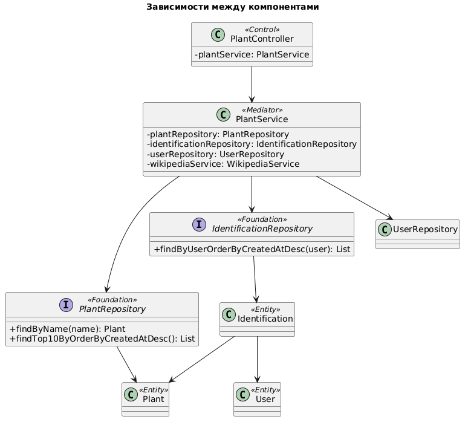
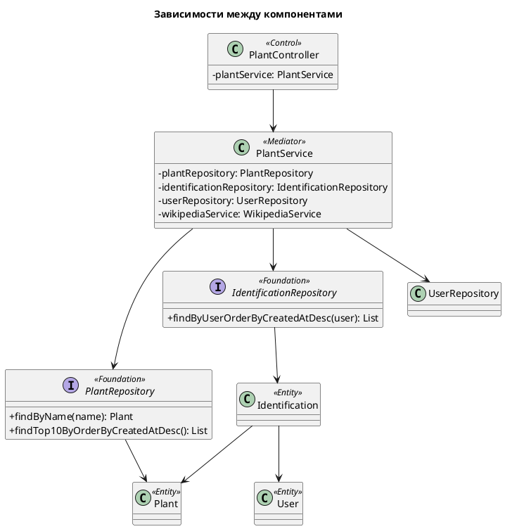

# Интерфейсы между слоями

## Описание

Слои PCMEF взаимодействуют через Spring-бины, внедряемые через конструктор (constructor injection).

## Control → Mediator

`PlantController` зависит от `PlantService`:

```java
@Controller
public class PlantController {
    private final PlantService plantService; // Mediator

    public PlantController(PlantService plantService) {
        this.plantService = plantService;
    }
}
```

## Mediator → Foundation

`PlantService` зависит от репозиториев:

```java
@Service
public class PlantService {
    private final PlantRepository plantRepository;       // Foundation
    private final IdentificationRepository identRepo;   // Foundation
    private final UserRepository userRepository;        // Foundation
}
```

## Foundation → Entity

Репозитории типизированы по JPA-сущностям:

```java
public interface PlantRepository extends JpaRepository<Plant, Long> {
    Plant findByName(String name);
    List<Plant> findTop10ByOrderByCreatedAtDesc();
}

public interface IdentificationRepository extends JpaRepository<Identification, Long> {
    List<Identification> findByUserOrderByCreatedAtDesc(User user);
}
```

## Диаграмма зависимостей



### PlantUML-код


