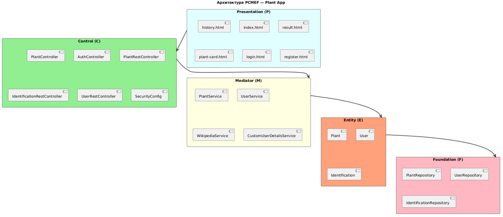
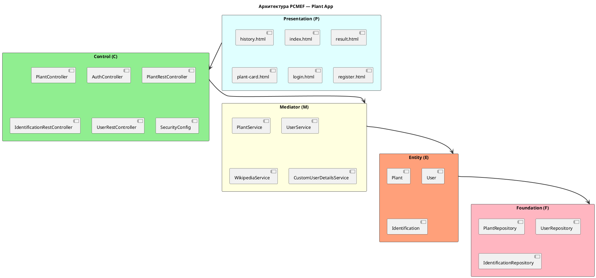

# PCMEF-диаграмма

## Описание

Диаграмма описывает разбивку системы на 5 архитектурных слоёв с зависимостями строго сверху вниз.

## PlantUML-код

```plantuml
@startuml pcmef-diagram
skinparam packageStyle rectangle
skinparam package {
  BorderColor #555
  BackgroundColor #FAFAFA
}
skinparam arrow {
  Color #333
  Thickness 2
}

title Архитектура PCMEF — Plant App

package "Presentation (P)" #LightCyan {
  [index.html]
  [result.html]
  [history.html]
  [plant-card.html]
  [login.html]
  [register.html]
}

package "Control (C)" #LightGreen {
  [PlantController]
  [AuthController]
  [PlantRestController]
  [IdentificationRestController]
  [UserRestController]
  [SecurityConfig]
}

package "Mediator (M)" #LightYellow {
  [PlantService]
  [UserService]
  [WikipediaService]
  [CustomUserDetailsService]
}

package "Entity (E)" #LightSalmon {
  [Plant]
  [User]
  [Identification]
}

package "Foundation (F)" #LightPink {
  [PlantRepository]
  [UserRepository]
  [IdentificationRepository]
}

[Presentation (P)] -down-> [Control (C)]
[Control (C)] -down-> [Mediator (M)]
[Mediator (M)] -down-> [Entity (E)]
[Entity (E)] -down-> [Foundation (F)]
@enduml
```