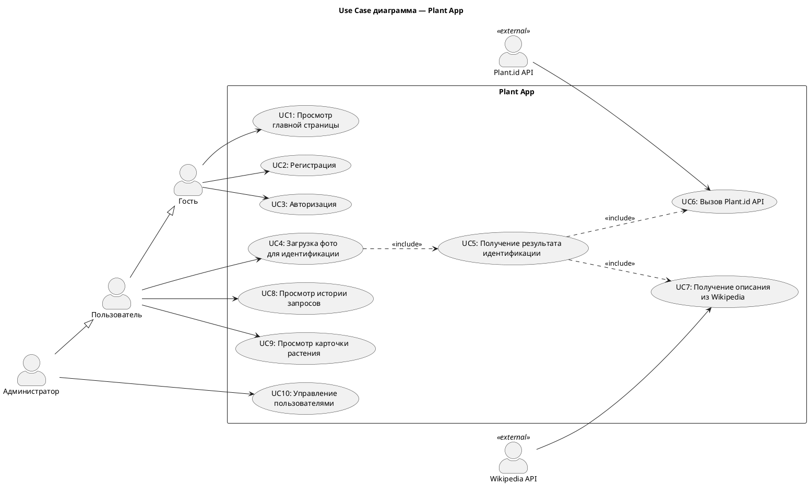

# Use Case диаграмма

## Описание

Диаграмма вариантов использования описывает функциональные требования с точки зрения пользователей системы.

## PlantUML-код

> Скопируй код на [plantuml.com](https://www.plantuml.com/plantuml/uml/) → скачай PNG → сохрани как `docs/02-requirements/images/use-case-diagram.png`
