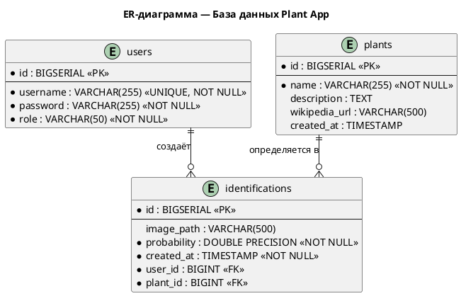

# ER-диаграмма

## Описание

Диаграмма сущность-связь описывает структуру базы данных PostgreSQL.

## PlantUML-код

> Скопируй код на [plantuml.com](https://www.plantuml.com/plantuml/uml/) → скачай PNG → сохрани как `docs/04-database/images/er-diagram.png`
