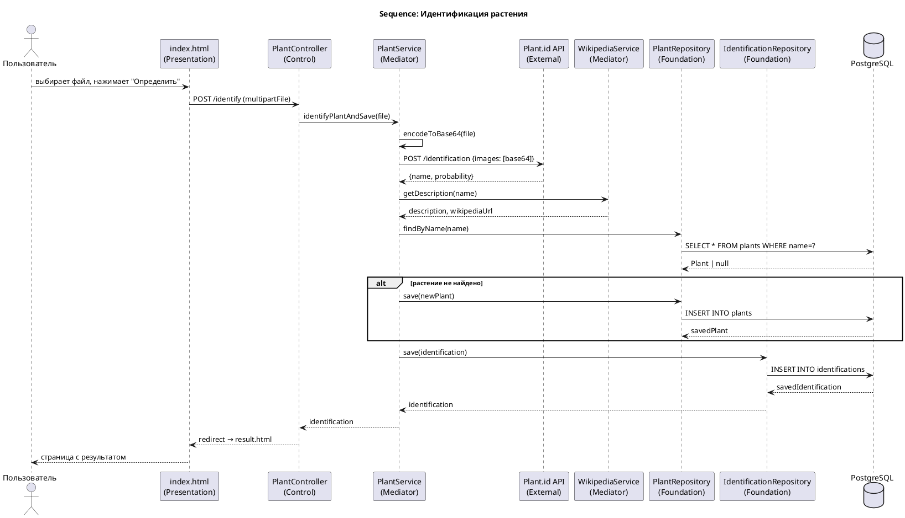
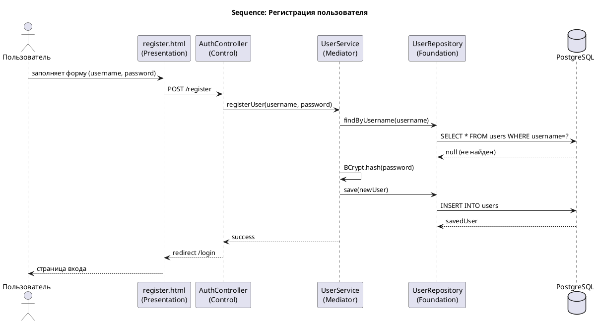
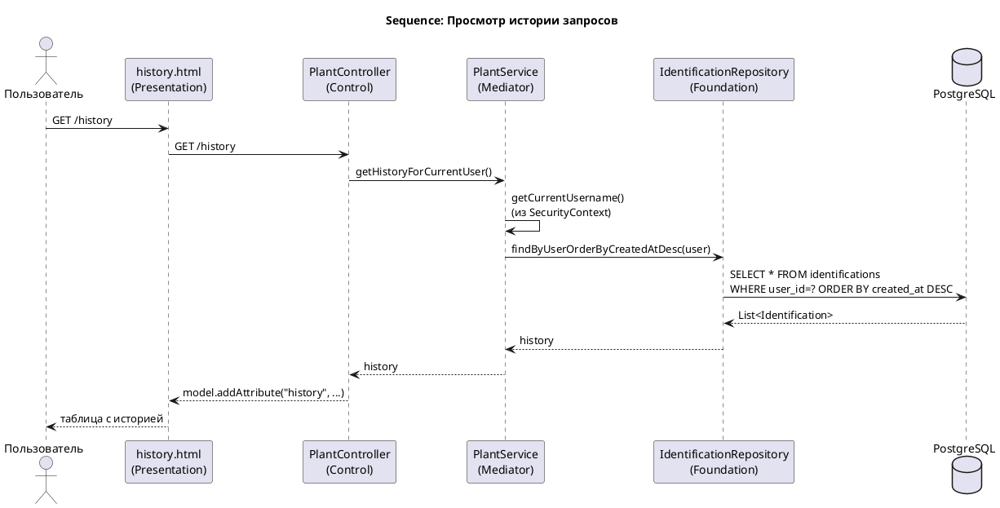

# Sequence-диаграммы

## 1. Идентификация растения

### PlantUML-код

> Сохрани PNG как `docs/05-design/images/seq-identify.png`

---

## 2. Регистрация пользователя

### PlantUML-код

> Сохрани PNG как `docs/05-design/images/seq-register.png`

---

## 3. Просмотр истории запросов

### PlantUML-код

> Сохрани PNG как `docs/05-design/images/seq-history.png`
