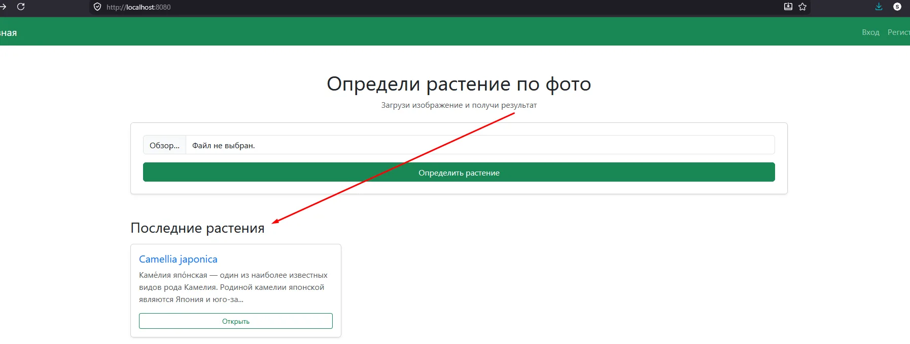
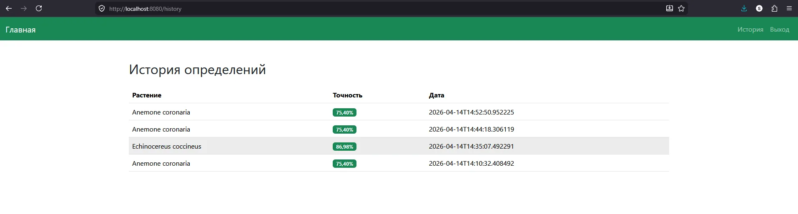
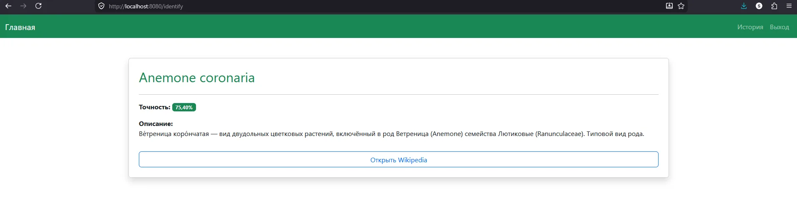
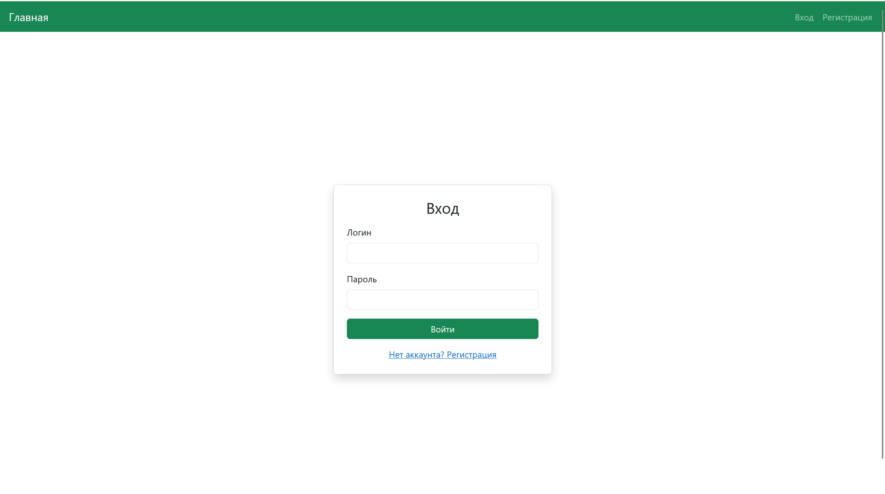
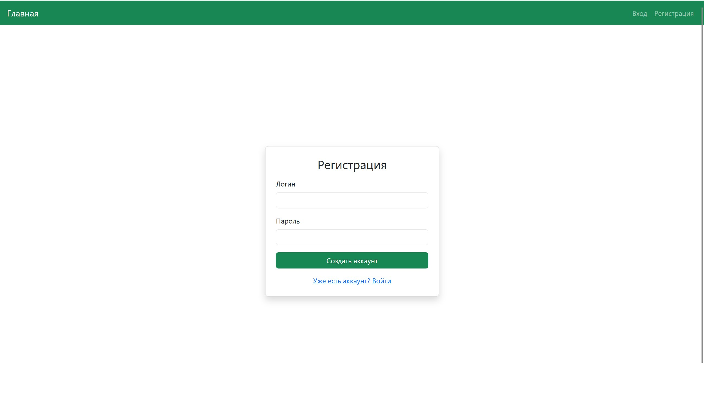

# Скриншоты интерфейса

Скриншоты сделаны в браузере при запущенном приложении (`http://localhost:8080`).

## Главная страница

Лендинг с формой загрузки фотографии и списком последних определённых растений.

---

## Страница результата идентификации

Отображает название растения, вероятность определения и описание из Wikipedia.

---

## История запросов

Таблица с историей идентификаций текущего пользователя, отсортированная по дате (новые сверху).

---

## Карточка растения

Детальная страница растения: название, описание, ссылка на Wikipedia.

---

## Страница входа

Форма авторизации с валидацией.

---

## Страница регистрации

Форма регистрации нового пользователя.
